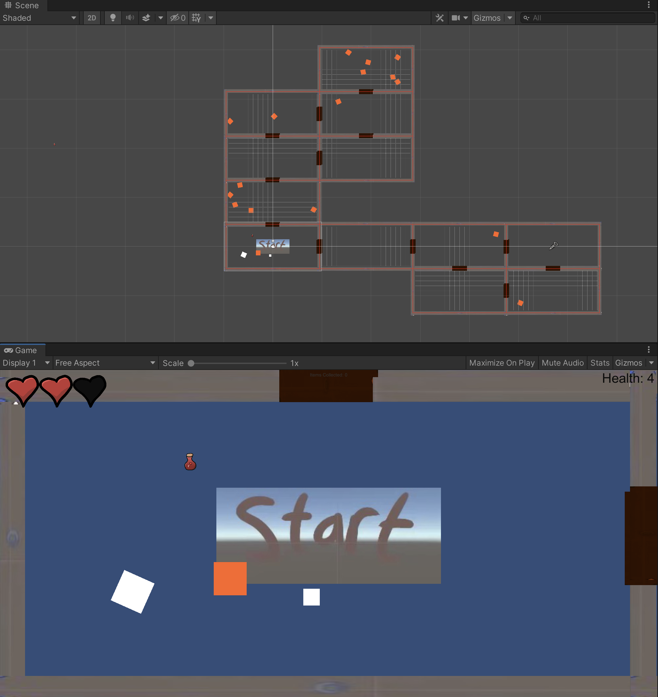

# Unity Tutorial for Binding of Isaac 

>Tutorial: https://www.youtube.com/watch?v=jQClYQ4cK-E&list=PLosGp2abdYXQF3ukYDoB3mzX0h0eKWXkQ&index=1

## Screenshot

## Function

+ Room Generation(randomly)
+ Item Generation(randomly)
+ Basic Enemy Generation(randomly)
+ Familiar,which could follow player and attack enemy
+ Player, could move, attack enemy, pick item 

